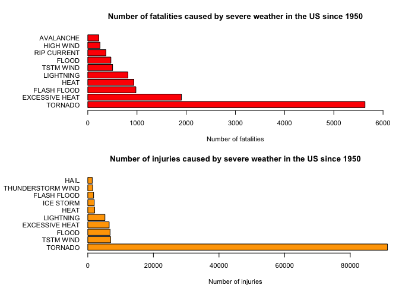
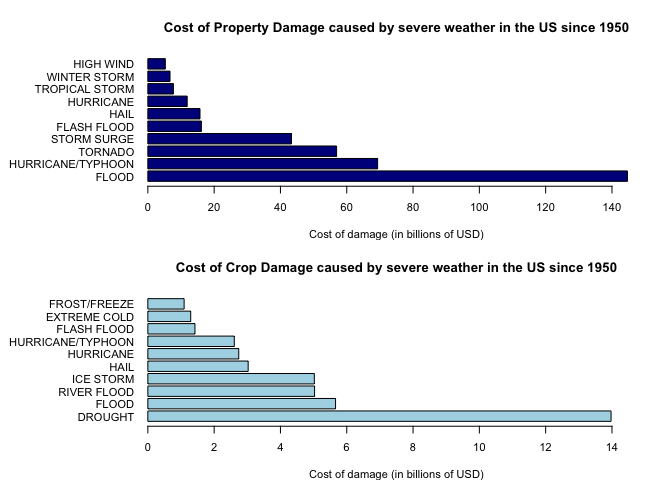

# Health and Economic consequences of severe weather events in United States since 1950
22 July 2017  

### Synopsis
Storms and other severe weather events can cause both public health and economic problems for communities and municipalities. Many severe events can result in fatalities, injuries, and property damage, and preventing such outcomes to the extent possible is a key concern.

This project is part of the Coursera Data Science Specialisation and completes the course on Reproducible Research. It involves exploring the U.S. National Oceanic and Atmospheric Administration's (NOAA) storm database. This database tracks characteristics of major storms and weather events in the United States, including when and where they occur, as well as estimates of any fatalities, injuries, and property damage.

The data covers the period between 1950 and November 2011, and although there are missing data, especially in earlier years, there are clear consequences identified on both health and economic situations.

### Data Processing

The data can be downloaded here: [Storm Data](https://d396qusza40orc.cloudfront.net/repdata%2Fdata%2FStormData.csv.bz2) 

Documentation of the database is available here:
National Weather Service [Storm Data Documentation](https://d396qusza40orc.cloudfront.net/repdata%2Fpeer2_doc%2Fpd01016005curr.pdf)

National Climatic Data Center Storm Events [FAQ](https://d396qusza40orc.cloudfront.net/repdata%2Fpeer2_doc%2FNCDC%20Storm%20Events-FAQ%20Page.pdf)

Load necessary library (R.utils) to unzip and open the bzip2 file, then load and examine the data.


```r
storm <- read.csv("StormData.csv", header = TRUE)
```

Strategy for Large Data Size

1. Reduce the data frame to focus on the questions at hand.

2. This would include event types, and types of harm (fatalities, injuries) variables in Q1

3. For Q2, we need to see variables also connected with economic factors (crop and property damage)


```r
library(plyr)
library(dplyr)
```

```
## 
## Attaching package: 'dplyr'
```

```
## The following objects are masked from 'package:plyr':
## 
##     arrange, count, desc, failwith, id, mutate, rename, summarise,
##     summarize
```

```
## The following objects are masked from 'package:stats':
## 
##     filter, lag
```

```
## The following objects are masked from 'package:base':
## 
##     intersect, setdiff, setequal, union
```

```r
library(ggplot2)

storm1 <- storm %>%
        select(EVTYPE, FATALITIES, INJURIES, PROPDMG, PROPDMGEXP, CROPDMG, CROPDMGEXP)

sum(is.na(storm1)) # Check missing values
```

```
## [1] 0
```

```r
# Prepare and sort health data by event type
fatal <- aggregate(FATALITIES ~ EVTYPE, data = storm1, sum)
injury <- aggregate(INJURIES ~ EVTYPE, data = storm1, sum)

top10fatal <- fatal[order(-fatal$FATALITIES), ][1:10, ]
top10injury <- injury[order(-injury$INJURIES), ][1:10, ]

# Examine levels of the damage variables
levels(storm1$PROPDMGEXP)
```

```
##  [1] ""  "-" "?" "+" "0" "1" "2" "3" "4" "5" "6" "7" "8" "B" "h" "H" "K"
## [18] "m" "M"
```

```r
levels(storm1$CROPDMGEXP)
```

```
## [1] ""  "?" "0" "2" "B" "k" "K" "m" "M"
```

Strategy for Poor Data Quality

1. To determine the monetary loss, the damage column ("CROPDMG" or "PROPDMG") should be multiplied by the exponential value in the corresponding "...DMGEXP" column.

2. Estimates should be rounded to three significant digits, followed by an alphabetical character signifying the magnitude of the number, 
i.e., 1.55B for $1,550,000,000. Alphabetical characters used to signify magnitude include "h" for hundreds, “K” for thousands, “M” for millions, and “B” for billions.

3. However, several entries contain other characters in the EXP columns.

4. Some of the entries contain numbers and so for this exercise I will ignore these as it is not clear in the documentation how to handle them.


```r
# Identify exponentials
storm1$PROPDMGEXP <- as.character(storm1$PROPDMGEXP)
storm1$CROPDMGEXP <- as.character(storm1$CROPDMGEXP)

stormEXP <- function(x) {
        if (x %in% c("b", "B"))  # identify billions
                return(9)
        else if (x %in% c("m", "M")) # identify millions
                return(6)
        else if (x %in% c("k", "K")) # identify thousands
                return(3)
        else if (x %in% c("h", "H")) # identify hundreds
                return(2)
        else if (x %in% c("", "?", "-", "+")) # identify non numerics
                return(0)
        else if (x %in% c("0", "1", "2", "3", "4", "5", "6", "7", "8")) # identify unknown values
                return(0)
        else if (!is.na(as.numeric(x)))
                return(as.numeric(x))
        else {
                stop()
        }
}
        
# Use the new exponential values
P_exp <- sapply(storm1$PROPDMGEXP, stormEXP)
C_exp <- sapply(storm1$CROPDMGEXP, stormEXP)

# Calculate the monetary loss for Property and Crop Damage

storm1$PropertyDamage <- storm1$PROPDMG * (10 ^ P_exp) / 1000000000
storm1$CropDamage <- storm1$CROPDMG * (10 ^ C_exp) /1000000000

# Structure data frame to show top 10 monetary losses by weather type

prop <- aggregate(PropertyDamage ~ EVTYPE, data = storm1, sum)
crop <- aggregate(CropDamage ~ EVTYPE, data = storm1, sum)

top10prop <- prop[order(-prop$PropertyDamage), ][1:10, ]
top10crop <- crop[order(-crop$CropDamage), ][1:10, ]
```

### Results

Question 1. Across the US, which types of events are most harmful with respect to population health?


```r
# Prepare data for plotting
par(mfrow = c(2,1), mar = c(4, 11, 4, 2), mgp = c(3, 1, 0), cex = 0.7)
barplot(top10fatal$FATALITIES, 
        names.arg = top10fatal$EVTYPE, 
        horiz = TRUE,
        main = "Number of fatalities caused by severe weather in the US since 1950",
        xlab = "Number of fatalities", 
        xlim = c(0,6000),
        las = 1,
        col = "red")
barplot(top10injury$INJURIES, 
        names.arg = top10injury$EVTYPE, 
        horiz = TRUE,
        main = "Number of injuries caused by severe weather in the US since 1950",
        xlab = "Number of injuries", 
        xlim = c(0,90000),
        las = 1,
        col = "orange")
```

<!-- -->

Question 2. Across the United States, which types of events have the greatest economic consequences?


```r
## Economic consequences outlined in the data includes property and crop damage due to severe weather.

par(mfrow = c(2,1), mar = c(4, 11, 4, 2), mgp = c(3, 1, 0), cex = 0.7)
barplot(top10prop$PropertyDamage, 
        names.arg = top10prop$EVTYPE, 
        horiz = TRUE,
        main = "Cost of Property Damage caused by severe weather in the US since 1950",
        xlab = "Cost of damage (in billions of USD)", 
        xlim = c(0,150),
        las = 1,
        col = "darkblue")
barplot(top10crop$CropDamage, 
        names.arg = top10crop$EVTYPE, 
        horiz = TRUE,
        main = "Cost of Crop Damage caused by severe weather in the US since 1950",
        xlab = "Cost of damage (in billions of USD)", 
        xlim = c(0,15),
        las = 1,
        col = "lightblue")
```

<!-- -->

### Conclusion

Tornados are the biggest weather related cause of death or injury in the United States over the period of 1950 - 2011.

The biggest cause of property damage is due to flooding and drought is the biggest cause of crop damage.


================================================================================================


