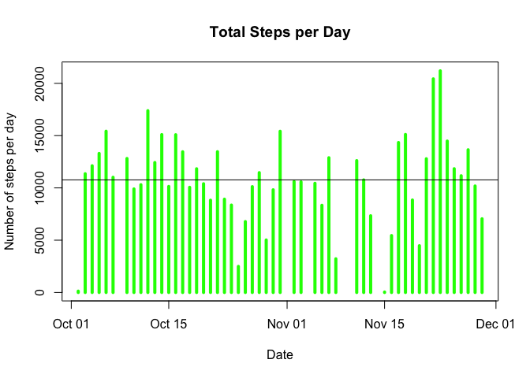
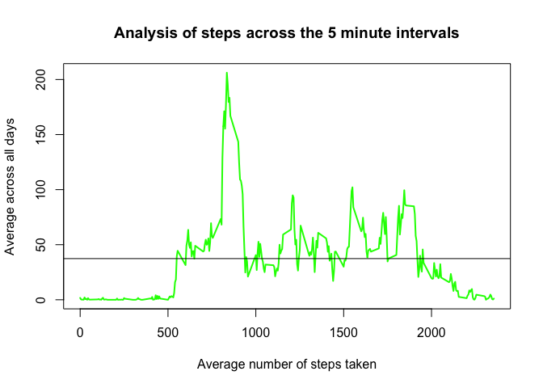
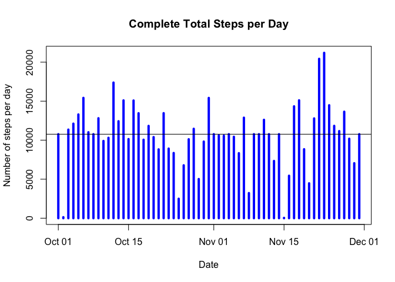
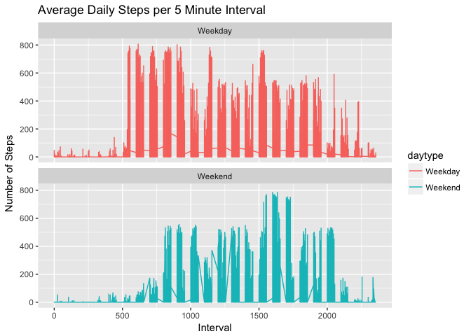

# Course Project 1 - ReprodResearch
Mick Sheahan  
7/14/2017  

## Loading and preprocessing the data


```r
## 1. Load and examine the data

actdata <- read.csv("activity.csv", header = TRUE, sep = ",")
head(actdata)
```

```
##   steps       date interval
## 1    NA 2012-10-01        0
## 2    NA 2012-10-01        5
## 3    NA 2012-10-01       10
## 4    NA 2012-10-01       15
## 5    NA 2012-10-01       20
## 6    NA 2012-10-01       25
```

```r
summary(actdata)
```

```
##      steps                date          interval     
##  Min.   :  0.00   2012-10-01:  288   Min.   :   0.0  
##  1st Qu.:  0.00   2012-10-02:  288   1st Qu.: 588.8  
##  Median :  0.00   2012-10-03:  288   Median :1177.5  
##  Mean   : 37.38   2012-10-04:  288   Mean   :1177.5  
##  3rd Qu.: 12.00   2012-10-05:  288   3rd Qu.:1766.2  
##  Max.   :806.00   2012-10-06:  288   Max.   :2355.0  
##  NA's   :2304     (Other)   :15840
```

```r
str(actdata)
```

```
## 'data.frame':	17568 obs. of  3 variables:
##  $ steps   : int  NA NA NA NA NA NA NA NA NA NA ...
##  $ date    : Factor w/ 61 levels "2012-10-01","2012-10-02",..: 1 1 1 1 1 1 1 1 1 1 ...
##  $ interval: int  0 5 10 15 20 25 30 35 40 45 ...
```

```r
## 2. Convert date column to class: Date

actdata$date <- as.Date(actdata$date)

## 3. Load packages for data manipulation

## This task will require some manipulation and reshaping of the data in the original data set.
## For this I will use the reshape2 package by Hadley Wickham (http://had.co.nz/reshape/introduction.pdf)

library(lubridate)
```

```
## 
## Attaching package: 'lubridate'
```

```
## The following object is masked from 'package:base':
## 
##     date
```

```r
library(dplyr)
```

```
## Warning: package 'dplyr' was built under R version 3.4.1
```

```
## 
## Attaching package: 'dplyr'
```

```
## The following objects are masked from 'package:lubridate':
## 
##     intersect, setdiff, union
```

```
## The following objects are masked from 'package:stats':
## 
##     filter, lag
```

```
## The following objects are masked from 'package:base':
## 
##     intersect, setdiff, setequal, union
```

```r
library(reshape2)
library(ggplot2)
```

## What is mean total number of steps taken per day?


```r
## A. Process data using melt and cast function and remove NA values to format the data.
## This enables the possibility to calculate the total number of steps per day.

mdata <- melt(actdata, id.vars = "date", measure.vars = "steps", na.rm = TRUE)

actdata1 <- dcast(mdata, date ~ variable, sum)  # actdata1 is new data frame by date

## B. Make histogram of total steps taken per day

plot(actdata1$date, actdata1$steps,
     type = "h",
     main = "Total Steps per Day", 
     xlab = "Date", 
     ylab = "Number of steps per day",
     lwd = 4,
     col = "green")
abline(h = mean(actdata1$steps, na.rm = TRUE), lwd = 1)
```

<!-- -->

```r
## C. Calculate the mean and median of the total number of steps taken per day

summary(actdata1)
```

```
##       date                steps      
##  Min.   :2012-10-02   Min.   :   41  
##  1st Qu.:2012-10-16   1st Qu.: 8841  
##  Median :2012-10-29   Median :10765  
##  Mean   :2012-10-30   Mean   :10766  
##  3rd Qu.:2012-11-16   3rd Qu.:13294  
##  Max.   :2012-11-29   Max.   :21194
```

```r
mean_steps <- mean(actdata1$steps)
mean_steps
```

```
## [1] 10766.19
```

```r
med_steps <- median(actdata1$steps)
med_steps
```

```
## [1] 10765
```


## What is the average daily activity pattern?


```r
## A. Make a time series plot of the 5-minute interval (x-axis) and the average number of steps taken, averaged across all days (y-axis)

## Using same process, change date for interval and calculate average

mOrigData <- melt(actdata, id.vars = "interval", measure.vars = "steps", na.rm = TRUE)

actdata2 <- dcast(mOrigData, interval ~ variable, mean)  # actdata2 is a new data frame by interval

plot(actdata2$interval, actdata2$steps,
     type = "l",
     main = "Analysis of steps across the 5 minute intervals", 
     xlab = "Average number of steps taken", 
     ylab = "Average across all days",
     lwd = 2,
     col = "green")
abline(h = mean(actdata2$steps, na.rm = TRUE), lwd = 1)
```

<!-- -->

```r
## B. Which 5-minute interval, on average across all the days in the dataset, contains the maximum number of steps?

max_interval <- actdata2$interval[which(actdata2$steps == max(actdata2$steps))]
mean_steps_at_max_interval <- max(actdata2$steps)
max_interval
```

```
## [1] 835
```

```r
mean_steps_at_max_interval
```

```
## [1] 206.1698
```


## Imputing missing values


```r
## A. Calculate and report the total number of missing values in the dataset (i.e. the total number of rows with 𝙽𝙰s)

missing_values <- sum(is.na(actdata))
missing_values
```

```
## [1] 2304
```

```r
## B. Devise a strategy for filling in all of the missing values in the dataset. 
## The strategy does not need to be sophisticated. 
## For example, you could use the mean/median for that day, or the mean for that 5-minute interval, etc.

## Strategy: Use the mean number of steps per 5 minute interval to capture the best estimate using common behaviour patterns

## C. Create a new dataset that is equal to the original dataset but with the missing data filled in

## Use previous data frame with average per interval to replace NA values

actdata3 <- actdata
dataNA <- is.na(actdata3$steps)

data_int <- tapply(actdata3$steps, actdata3$interval, mean, na.rm = TRUE, simplify = TRUE)
actdata3$steps[dataNA] <- data_int[as.character(actdata3$interval[dataNA])]

head(actdata3)
```

```
##       steps       date interval
## 1 1.7169811 2012-10-01        0
## 2 0.3396226 2012-10-01        5
## 3 0.1320755 2012-10-01       10
## 4 0.1509434 2012-10-01       15
## 5 0.0754717 2012-10-01       20
## 6 2.0943396 2012-10-01       25
```

```r
## Check there are no more NA values
sum(is.na(actdata3))
```

```
## [1] 0
```

```r
## D. Make a histogram of the total number of steps taken each day and calculate and report the mean and median total number of steps taken per day.

mdata3 <- melt(actdata3, id.vars = "date", measure.vars = "steps", na.rm = FALSE)

steps_per_date <- dcast(mdata3, date ~ variable, sum)

plot(steps_per_date$date, steps_per_date$steps,
     type = "h",
     main = "Complete Total Steps per Day", 
     xlab = "Date", 
     ylab = "Number of steps per day",
     lwd = 4,
     col = "blue")
abline(h = mean(steps_per_date$steps), lwd = 1)
```

<!-- -->

```r
## Calculate the new mean and median of the total number of steps taken per day

summary(steps_per_date)
```

```
##       date                steps      
##  Min.   :2012-10-01   Min.   :   41  
##  1st Qu.:2012-10-16   1st Qu.: 9819  
##  Median :2012-10-31   Median :10766  
##  Mean   :2012-10-31   Mean   :10766  
##  3rd Qu.:2012-11-15   3rd Qu.:12811  
##  Max.   :2012-11-30   Max.   :21194
```

```r
mean_complete_steps <- mean(steps_per_date$steps)
mean_complete_steps
```

```
## [1] 10766.19
```

```r
med_complete_steps <- median(steps_per_date$steps)
med_complete_steps
```

```
## [1] 10766.19
```

Do these values differ from the estimates from the first part of the assignment?

No. There is no significant difference in applying the 5 minute interval averages to the NA values.


## Are there differences in activity patterns between weekdays and weekends?


```r
## A. Create a new factor variable in the dataset with two levels – “weekday” and “weekend” indicating whether a given date is a weekday or weekend day.

actdata3 <- actdata3 %>%
        mutate(daytype = ifelse(weekdays(actdata3$date) == "Saturday" |
                                weekdays(actdata3$date) == "Sunday",
                                "Weekend", "Weekday" ))
head(actdata3)
```

```
##       steps       date interval daytype
## 1 1.7169811 2012-10-01        0 Weekday
## 2 0.3396226 2012-10-01        5 Weekday
## 3 0.1320755 2012-10-01       10 Weekday
## 4 0.1509434 2012-10-01       15 Weekday
## 5 0.0754717 2012-10-01       20 Weekday
## 6 2.0943396 2012-10-01       25 Weekday
```

```r
## B. Make a panel plot containing a time series plot (i.e. 𝚝𝚢𝚙𝚎 = "𝚕") of the 5-minute interval (x-axis)
## and the average number of steps taken, averaged across all weekday days or weekend days (y-axis). 
## See the README file in the GitHub repository to see an example of what this plot should look like using simulated data.

ggplot(actdata3, aes(x = interval, y = steps, color = daytype)) +
        geom_line() +
        labs(title = "Average Daily Steps per 5 Minute Interval",
             x = "Interval", y = "Number of Steps") +
        facet_wrap(~daytype, ncol = 1, nrow = 2)
```

<!-- -->

## Codebook

* actdata = original activity data set
* actdata1 = original data set reshaped to show total steps per date. (NA values removed)
* actdata2 = original data set reshaped to show total steps per interval. (NA values removed)
* actdata3 = new activity data set with filled in missing values


